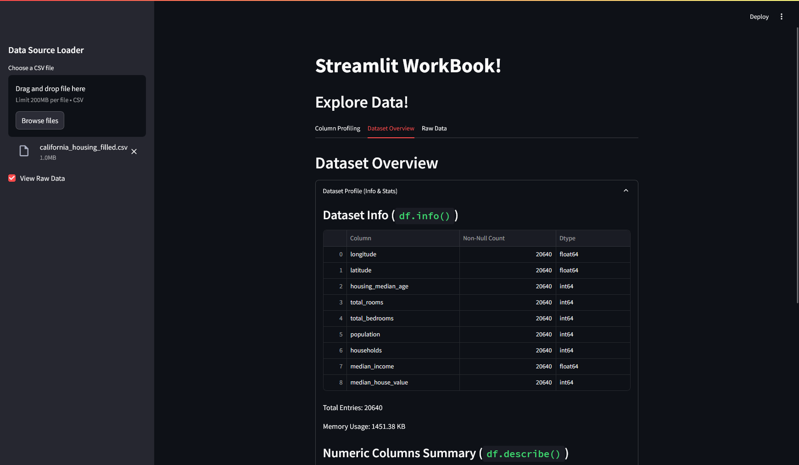
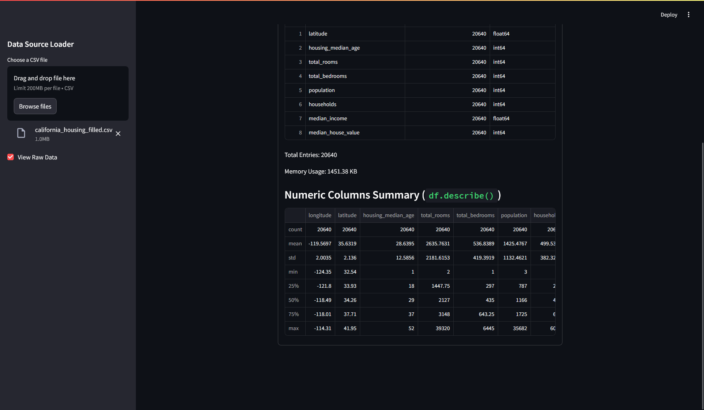
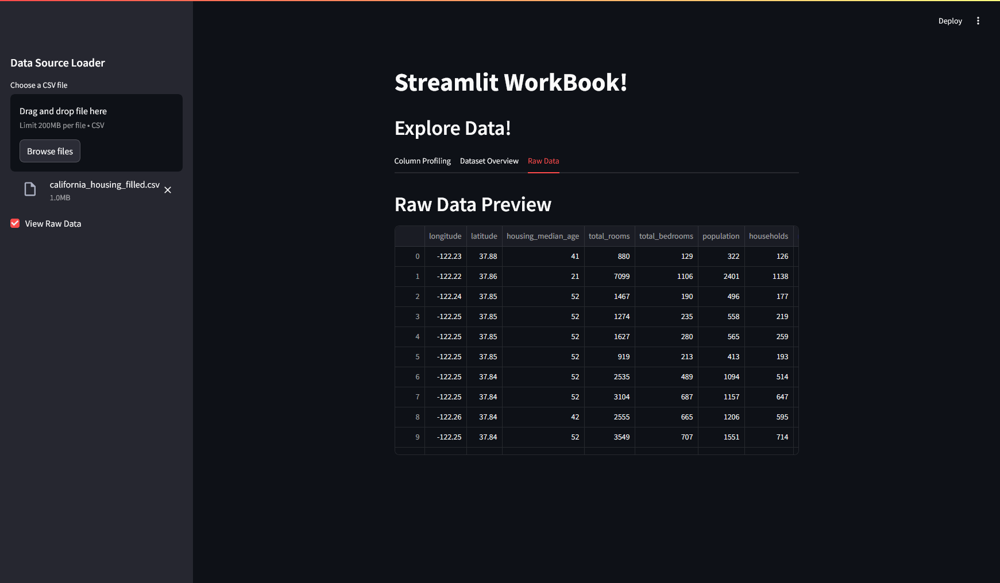
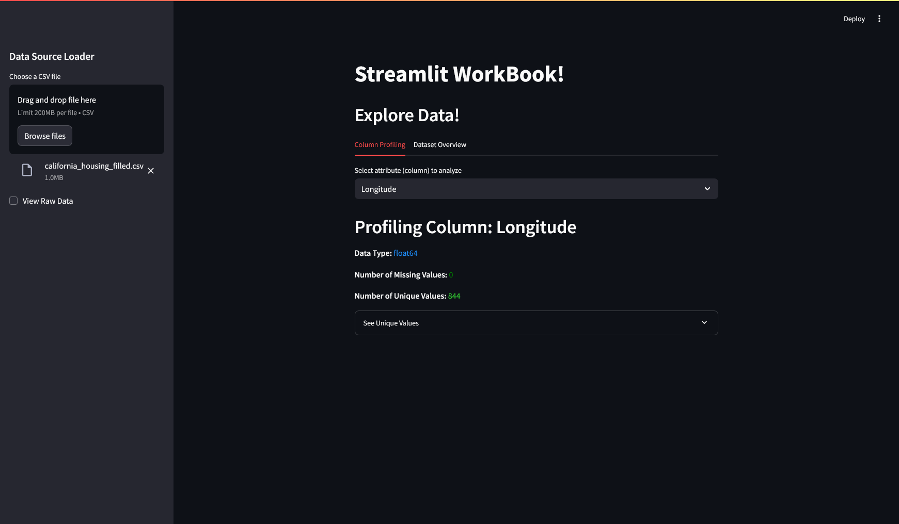

### III. Sidebar and Layout

**Objective:** Organize content with Streamlit layout components.

**Tasks:**

* Use `st.sidebar` for filters and options
* Use `st.columns` or `st.tabs` to organize content
* Toggle sections with `st.expander`
* Use your own content for this
* *Note: Content should be related to Data Warehousing and Enterprise Data Management.*

## Description

This Streamlit application, app.py, allows users to upload a CSV file and then perform an initial exploration of its contents. It provides features to profile individual columns by showing their data type, missing values, and unique entries, as well as offering a general overview of the dataset with summary statistics and data types for all columns. Users can also optionally view the raw data from the uploaded file.

## Application Screenshot

Here's a look at the Streamlit application interface:

This is the look when page load

This will be the look when csv is uploaded

When raw view data is unchecked, no raw view data is displayed
