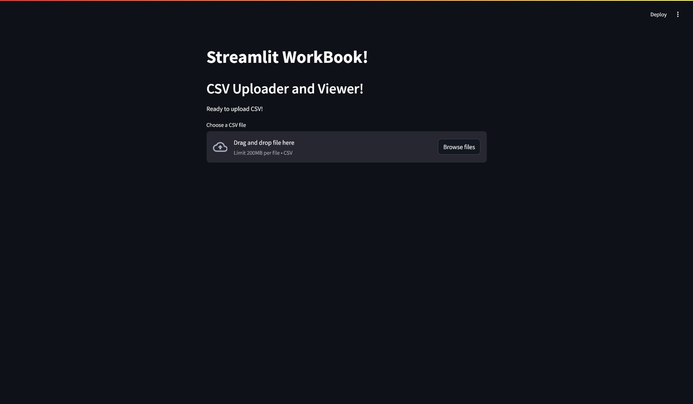
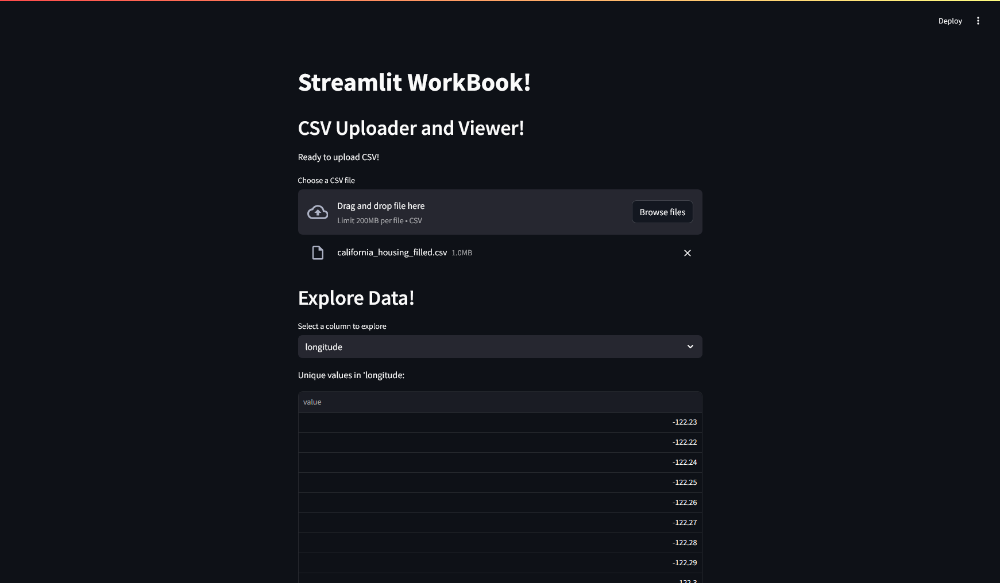
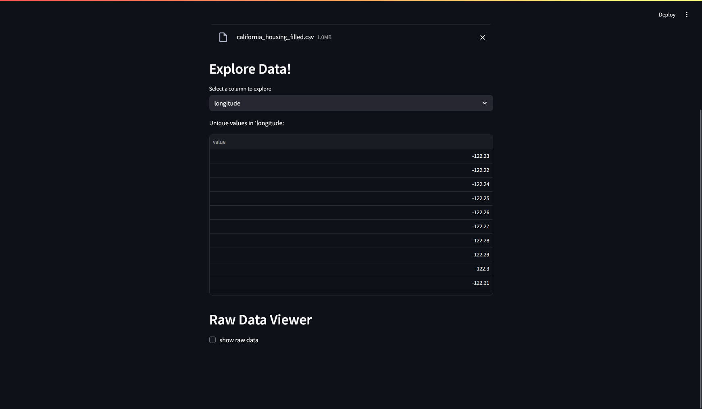

### II. DataFrame Viewer

**Objective:** Load and display data.

**Tasks:**

* Upload a CSV file using `st.file_uploader`
* Load it with `pandas`
* Show the dataframe with `st.dataframe`
* Use `st.checkbox` to toggle viewing the raw data
* Use `st.selectbox` to filter by a column
* *Note: File data should contain a minimum of 5 columns.*

## Description

This Streamlit application, app.py, provides a simple interface for users to upload CSV files. Once a file is uploaded and validated to have at least five columns, the app allows users to select a specific column and view its unique values. Additionally, users have the option to display the entire raw dataset from the uploaded CSV.

## Application Screenshot

Here's a look at the Streamlit application interface:

