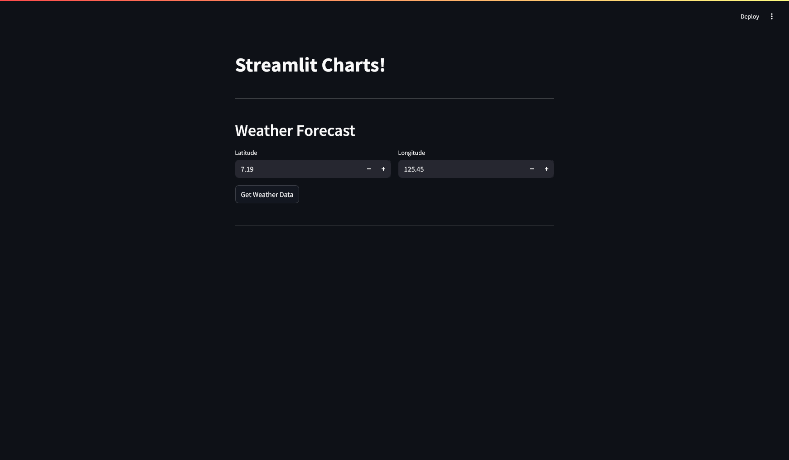
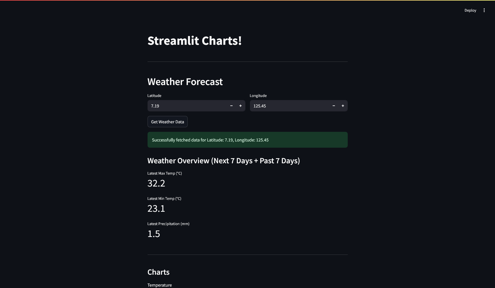
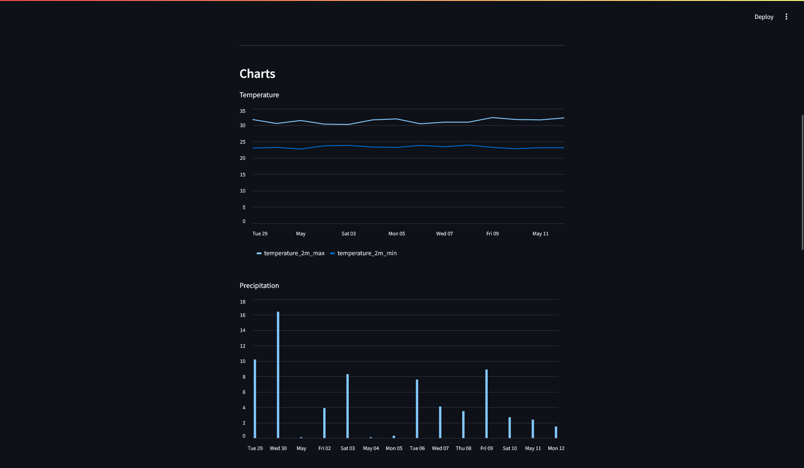
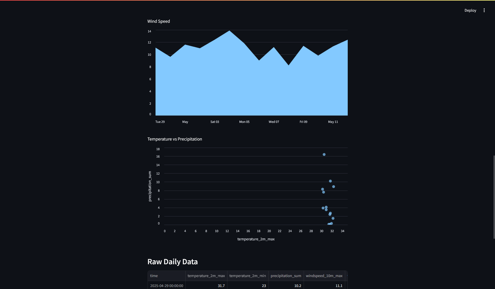
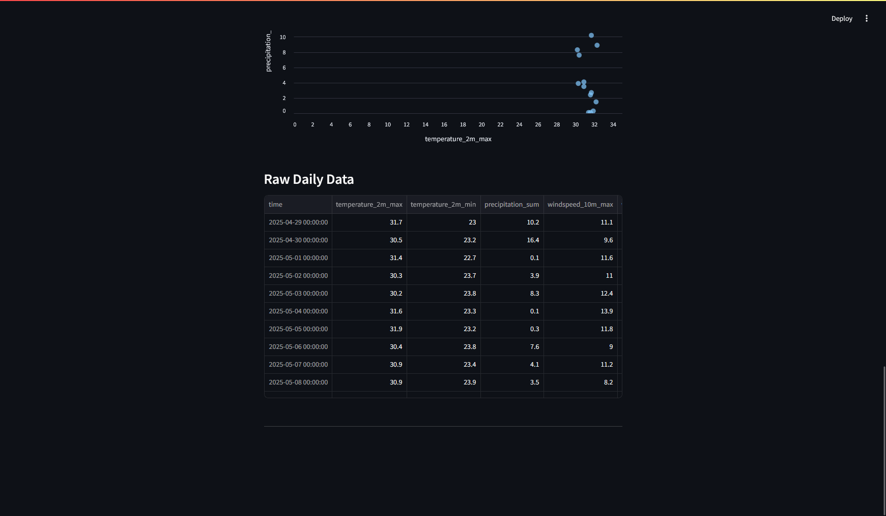

### IV. Fetch and Display API Data

**Objective:** Connect to an external API and display results.

**Tasks:**

* Use `requests` to call a public API (e.g., weather, covid-19 stats)
* Parse JSON data
* Display results with Streamlit widgets and charts
* *Note: Minimum of 5 chart types.*

## Description

This Streamlit application is designed to help you explore CSV files by allowing you to upload a file and then dive into its details. It features tabs to separate different views: one for profiling individual columns (showing data types, missing values, and unique entries) and another for a general overview of the entire dataset, including summary statistics. You also have the option in the sidebar to toggle the display of the raw, unprocessed data from your uploaded file.

## Application Screenshot

Here's a look at the Streamlit application interface:

