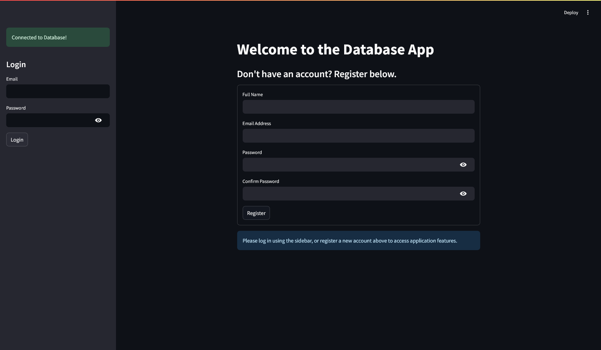
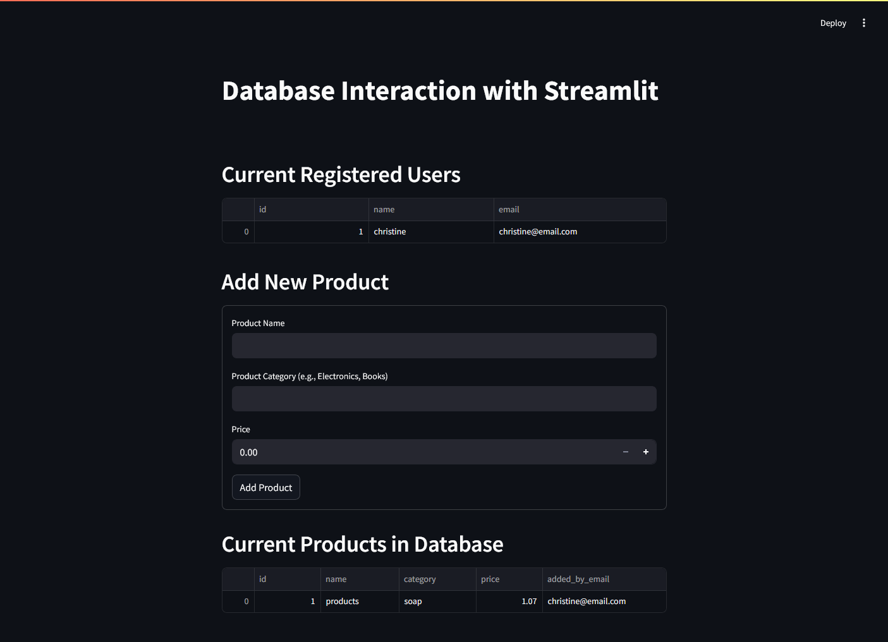

### V. Data Pipeline with Database

**Objective:** Integrate a Streamlit app with a relational database (MySQL).

**Tasks:**

* Connect a DB using `sqlalchemy` or `psycopg2`
* Fetch and filter data via SQL queries
* Display query results with `st.dataframe`
* Insert new rows with forms
* **Bonus:** Add user authentication (Additional points)

## Description

This Streamlit application, app.py, provides a secure interface for interacting with a database, featuring user authentication with password hashing and salting. After logging in or registering, users can view a list of registered users and manage a product catalog by adding new products and viewing existing ones. The app uses Streamlit's built-in SQL connection to handle database operations for both user management and product data.

## Application Screenshot

Here's a look at the Streamlit application interface:

